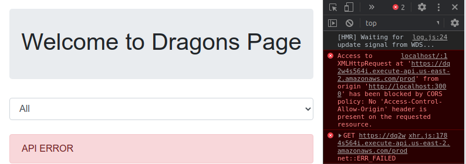

# DRAGONS PAGE

## WebSite using DynamoDB created with AWS-CDK

RUNNING CODE: http://dragonspagestack-drangonswebsitebucket13f805ec-eumb1tfov1i5.s3-website.us-east-2.amazonaws.com/

LINKEDIN: https://www.linkedin.com/pulse/website-using-dynamodb-created-aws-cdk-zimmermann-negreiros/

**DRAGONS PAGE** changes the exercices of the course **Amazon DynamoDB: Building NoSQL Database-Driven Applications**  https://www.coursera.org/learn/dynamodb-nosql-database-driven-apps/home/welcome to be done using the AWS CDK. Thanks to Seph Robinson, Morgan Willis and Rick H for the course. (I also recommend the specialization AWS Fundamentals: Going Cloud-Native that I did before.)

> This will help you to learn how to develop using the AWS Cloud Development Kit (AWS CDK).

## The Story:

*“One of your best friends (Mary) who you’ve known for years has come to you for help.*

*Mary has always been obsessed with fantasy dragons, and she has recently set up a gaming company and her latest project is a new dragon card game. She doesn’t have a website for their game yet and has been doing everything manually, even drawing the cards.*

*The problem is that she’s not very tech-savvy, which is why Mary reached out to you. There is currently no way to look up card details online. She has asked you to help her create a simple webpage that can show all the dragon cards when the page loads, and to be able to show any card and all of its information by doing a simple search on a dragon name.*

*You don’t even ask what budget she has, as you already know the answer. Zero. Besides, you want the practice, as you are sitting your developing on the AWS exam shortly.”* 

#### Before we start

*I'll usume that you are using linux ubuntu.* 

- AWS CLI: https://docs.aws.amazon.com/cli/latest/userguide/install-cliv2-linux.html
- AWS ACCOUNT: https://docs.aws.amazon.com/translate/latest/dg/setting-up.html
- NODE.JS: https://nodejs.org/
- TYPESCRIPT: run `npm install -g typescript`
- VSCODE - https://code.visualstudio.com/
- AWS TOOLKIT FOR VSCODE - https://docs.aws.amazon.com/toolkit-for-vscode/latest/userguide/welcome.html
- AWS CDK TOOLKIT - `npm install -g aws-cdk` to install, then `cdk --version` to test

#### Creating the Project

- Create the Dragons Page folder `mkdir dragonspage && cd $_`
- initialize the CDK app `cdk init app --language typescript`

To compiling your TypeScript code run `npm run watch`, this will start the TypeScript compiler (tsc) in "watch" mode, which will monitor your project directory and will automatically compile any changes to your .ts files to .js. You need to keep this terminal tab open and running, so open another tab in the terminal to work.

You can open VSCode with `code .` inside the project folder.

##### Optional: Lint and Prettier

Install Lint dependencies `npm i -D @typescript-eslint/eslint-plugin @typescript-eslint/parser eslint eslint-config-prettier eslint-plugin-prettier prettier`

create the `.eslintignore` file:

```
*.d.ts
cdk.out
```

create the `.eslintrc.js`

```
module.exports = {
  env: {
    browser: true,
    es2020: true,
  },
  extends: ['plugin:@typescript-eslint/recommended', 'prettier/@typescript-eslint', 'plugin:prettier/recommended'],
  parser: '@typescript-eslint/parser',
  parserOptions: {
    ecmaVersion: 11,
    sourceType: 'module',
    project: './tsconfig.json',
  },
  plugins: ['@typescript-eslint'],
  rules: {
    '@typescript-eslint/naming-convention': [
      'error',
      {
        selector: 'interface',
        format: ['PascalCase'],
        custom: {
          regex: '^I[A-Z]',
          match: true,
        },
      },
    ],
    '@typescript-eslint/no-floating-promises': ['error'],
    '@typescript-eslint/no-unused-vars': ['error', { argsIgnorePattern: '^_' }],
  },
};
```

create `.prettierrc.js`

```
module.exports = {
  semi: true,
  trailingComma: 'all',
  singleQuote: true,
  printWidth: 120,
  tabWidth: 2,
};
```
now in `package.json` modify *scripts*:
```
"scripts": {
  "build": "npm run prettier && npm run lint && tsc",
  "watch": "tsc -w",
  "test": "npm run build && npx jest",
  "cdk": "cdk",
  "prettier": "prettier --write '**/*.ts'",
  "lint": "eslint --fix --ext .ts ."
}
```

## Part 1 - Creating the DynamoDB table and API calls

*“You figure that a basic page with a search box, some CSS, and a few API calls to a database would probably work as a prototype. As you are planning on sitting your AWS developer associate exam shortly, you decide to force yourself to do most of these activities using the AWS CDK and get comfortable with code.*

*You think the best place to start is to create a DynamoDB table with an open schema. This way you can decide on the schema once you know what the data looks like, and how you plan on querying the data.”*

Let’s start creating the DynamoDB table. First, we need the DynamoDB dependency `npm i @aws-cdk/aws-dynamodb` and now, inside `lib/dragonspage-stack.ts` we need to import DynamoDB and then create the table inside the constructor:

```
import * as cdk from '@aws-cdk/core';
import * as dynamodb from '@aws-cdk/aws-dynamodb';

export class DragonspageStack extends cdk.Stack {
  constructor(scope: cdk.Construct, id: string, props?: cdk.StackProps) {
    super(scope, id, props);

    new dynamodb.Table(this, 'dragons', {
      partitionKey: { name: 'dragon_name', type: dynamodb.AttributeType.STRING },
      billingMode: dynamodb.BillingMode.PAY_PER_REQUEST,
      removalPolicy: cdk.RemovalPolicy.DESTROY,
    });
  }
}
```

This will create a new DynamoDB table with the **dragon_name** as a **Partition Key (PK)**, set the billing mode to Pay Per Request (so we don't need to provide the write and read capacity) and set to destroy the resource if we decide to delete. (and since this is a test one, we wanna it).

Now we have a table, so we need a way to Get, Post, and Delete items, to do it we will create a lambda function and an API endpoint to call it. Start creating the file `src/lambda/dragonsHandler.ts`, inside this file, we will put t lambda code that uses AWS-SDK, so let's install `npm i aws-sdk @types/aws-lambda`.


```
import AWS = require('aws-sdk');
import { IDragon } from '../interfaces/dragon';

const tableName = process.env.TABLE_NAME || '';
const dynamo = new AWS.DynamoDB.DocumentClient();

const createResponse = (body: string | AWS.DynamoDB.DocumentClient.ItemList, statusCode = 200) => {
  return {
    statusCode,
    body: JSON.stringify(body, null, 2),
  };
};

const getAllDragons = async () => {
  const scanResult = await dynamo.scan({ TableName: tableName }).promise();
  return scanResult;
};

const addDragonItem = async (data: IDragon) => {
  if (data) await dynamo.put({ TableName: tableName, Item: data }).promise();
  return data;
};

const deleteDragonItem = async (data: { dragon_name: string }) => {
  const { dragon_name } = data;
  if (dragon_name) await dynamo.delete({ TableName: tableName, Key: { dragon_name } }).promise();
  return dragon_name;
};

exports.handler = async function (event: AWSLambda.APIGatewayEvent) {
  try {
    const { httpMethod, body: requestBody } = event;

    if (httpMethod === 'GET') {
      const response = await getAllDragons();
      return createResponse(response.Items || []);
    }

    if (!requestBody) {
      return createResponse('Missing request body', 500);
    }

    const data = JSON.parse(requestBody);

    if (httpMethod === 'POST') {
      const dragon = await addDragonItem(data);
      return dragon
        ? createResponse(`${JSON.stringify(data)} added to the database`)
        : createResponse('Dragon is missing', 500);
    }

    if (httpMethod === 'DELETE') {
      const dragon = await deleteDragonItem(data);
      return dragon
        ? createResponse(`${JSON.stringify(data)} deleted from the database`)
        : createResponse('Dragon is missing', 500);
    }

    return createResponse(`Ops, something wrong!`, 500);
  } catch (error) {
    console.log(error);
    return createResponse(error, 500);
  }
};
```

You can see `import { IDragon } from '../interfaces/dragon';`, this is the interface that will validate the dragon item to be always the same that we want. We need to create `src/interfaces/dragon.ts`:

```
export interface IDragon {
  dragon_name: string;
  dragon_type: string;
  description: string;
  attack: number;
  defense: number;
}
```

In this file, we have a lambda function to Get all the dragons, Add a dragon, and Delete a dragon. This is far to be a perfect scenario, and Scan is not the right way to get items, but since we have just a few dragons to show to Mary, the code is good enough.

Open again `lib/dragonspage-stack.ts` to make the lambda work with the table and create the API endpoint that we can access.

Again we’ll need some dependencies: `npm i @aws-cdk/aws-lambda @aws-cdk/aws-apigateway`

```
import * as cdk from '@aws-cdk/core';
import * as dynamodb from '@aws-cdk/aws-dynamodb';
import * as lambda from '@aws-cdk/aws-lambda';
import * as apigateway from '@aws-cdk/aws-apigateway';

export class DragonspageStack extends cdk.Stack {
  public readonly handler: lambda.Function;

  constructor(scope: cdk.Construct, id: string, props?: cdk.StackProps) {
    super(scope, id, props);

    const dragonsTable = new dynamodb.Table(this, 'dragons', {
      partitionKey: { name: 'dragon_name', type: dynamodb.AttributeType.STRING },
      billingMode: dynamodb.BillingMode.PAY_PER_REQUEST,
      removalPolicy: cdk.RemovalPolicy.DESTROY,
    });

    const dragonsLambda = new lambda.Function(this, 'DragonsHandler', {
      code: lambda.Code.fromAsset('src/lambda'),
      handler: 'dragonsHandler.handler',
      runtime: lambda.Runtime.NODEJS_12_X,
      memorySize: 256,
      timeout: cdk.Duration.seconds(10),
      environment: {
        TABLE_NAME: dragonsTable.tableName,
      },
    });

    dragonsTable.grantReadWriteData(dragonsLambda);

    new apigateway.LambdaRestApi(this, 'DragonsEndpoint', {
      handler: dragonsLambda,
    });
  }
}
```
Just after the table, we add the lambda into the stack (and change the default memory and timeout to avoid that if some problem happens the code will not be stuck for 15 min). After that, we permit the lambda to be able to read and write data inside the DynamoDB table. And in the end, we create the API endpoint.

To publish the CloudFormation to create all the services that we want, just run `cdk deploy`, and wait to receive the API Endpoint - **save this URL because we will use it**.

**✅  DragonspageStack**

**https://<_SOME_CODE_>.execute-api.<_REGION_>.amazonaws.com/prod/**


> NOTE: if you receive a error like this one: 
```
⨯ Unable to compile TypeScript:
bin/dpage.ts:4:10 - error TS2305: Module '"../lib/dpage-stack"' has no exported member 'DpageStack'.

4 import { DpageStack } from '../lib/dpage-stack';
           ~~~~~~~~~~

Subprocess exited with error 1
```

Is because you are not using the `dragonspage` as the main folder. In the error above the folder is `dpage`, so to fix just rename `lib/dragonspage-stack.ts` to `lib/dpage-stack.ts` and `export class DragonspageStack extends cdk.Stack` to `export class DpageStack extends cdk.Stack`.

### Story continued

*“Now you have your database ready, it’s time to seed it with some data. You asked Mary for some card data and she has promised to email you a JSON document with all the card data and some dragon images. However, she keeps delaying. So, you think it’s a good idea to add a few items to help you create a basic proof of concept.*

*The API will return all the data in the database to the website. You only have 2 images from her so far, so your database needs to have only 2 items.*

*Your next step is to add a couple of dragon items to the database table that you just created. You think dragon info would look a bit like this (you are guessing). So you add this as a starting point while you wait for Mary to email you the real data.”*

| Primary Key (dragon_name) | dragon_type | description  | attack | defense |
| ------------------------- | ----------- | ------------ | ------ | ------- |
| sparky                    | green       | breaths acid | 10     | 7       |
| tallie                    | red         | breaths fire | 7      | 10      |


### Using the API Endpoint

Remember `./interfaces/dragon.ts`? Now, this file can be used as a base to create the dragon's data JSON files. Create the folder `./data` and inside:

dragon1.json
```
{
  "dragon_name": "sparky",
  "dragon_type": "green",
  "description": "breaths acid",
  "attack": 10,
  "defense": 7
}
```
dragon2.json
```
{
  "dragon_name": "tallie",
  "dragon_type": "red",
  "description": "breaths fire",
  "attack": 7,
  "defense": 10
}
```

To hit the endpoint we can use CURL, so let’s see if it works: `curl <URL_ENDPOINT>` the return will be just an empty array `[ ]`.

To add the dragons, run in the root folder `./` of your project (probably dragonspage if you are following the instructions):

Add Dragon 1: curl --header "Content-Type: application/json" --request POST --data @data/dragon1.json <URL_ENDPOINT>

Add Dragon 2: curl --header "Content-Type: application/json" --request POST --data @data/dragon2.json <URL_ENDPOINT>

Run again `curl <URL_ENDPOINT>` and the result will be:

```
[
  {
    "dragon_type": "green",
    "defense": 7,
    "description": "breaths acid",
    "attack": 10,
    "dragon_name": "sparky"
  },
  {
    "dragon_type": "red",
    "defense": 10,
    "description": "breaths fire",
    "attack": 7,
    "dragon_name": "tallie"
  }
]
```

Yeah, this is what we want. But if for some reason we send the wrong dragon data and want to delete, just run:

curl --header "Content-Type: application/json" --request DELETE --data '{"dragon_name": "<DRAGON_NAME>"}' <URL_ENDPOINT>

To destroy everything just run `CDK destroy` and the output will be similar to this:

**✅  DragonspageStack: destroyed**

But we don’t want to destroy everything right now, Mary would not like this as we still have to show what we are doing. So let’s create a quick React webpage to call the API and show the dragons that we have for now.

### Creating a React Single Page

> NOTE: This is not the ideal thing to do, have the frontend and backend inside the same repo, but just to keep things simple we'll use this way, like a mono-repo. I'll go fast and dirty in this part, the focus of this article  is not React, but the CDK.

First of all open `tsconfig.json` and add frontend to exclude `"exclude": ["cdk.out","frontend"]`. Now in the root folder `./` of the project start a new react page running `npx create-react-app frontend --template typescript --use-npm`, and `cd frontend/` then `npm start`... Right, probably you will receive an error like this one:

```
The react-scripts package provided by Create React App requires a dependency:

  "babel-jest": "^24.9.0"

Don't try to install it manually: your package manager does it automatically.
However, a different version of babel-jest was detected higher up in the tree:

  /.../dragonspage/node_modules/babel-jest (version: 25.5.1)
```

This is because react-create-app uses a different version of `babel-jest` than are already installed by the CDK. No problem, we can create the file `frontend/.env` and add `SKIP_PREFLIGHT_CHECK=true`.

Run `npm start` again and the default site will open in the browser. Keep the console tab running the react, open a new one to work.

Let’s add some dependencies in `frontend/` `npm install react-bootstrap bootstrap axios` and start the page. First copy the two dragons images to `frontend/public/`:

sparky.png


tallie.png


Inside `frontend/src/index.tsx`:
```
- import './index.css';
+ import 'bootstrap/dist/css/bootstrap.min.css';
```

adn inside `frontend/src/App.tsx`

```
import React, { useState, useEffect } from 'react';
import axios from 'axios';
import Jumbotron from 'react-bootstrap/Jumbotron';
import Container from 'react-bootstrap/Container';
import Row from 'react-bootstrap/Row';
import Col from 'react-bootstrap/Col';
import Form from 'react-bootstrap/Form';
import Alert from 'react-bootstrap/Alert';
import Card from 'react-bootstrap/Card';
import Table from 'react-bootstrap/Table';
import { IDragon } from '../../src/interfaces/dragon';

function App() {
  const apiEndpoint = '<API_ENDPOINT_URL>';
  const [dragons, setDragons] = useState<Array<IDragon>>([]);
  const [error, setError] = useState<{ message: string } | null>(null);

  useEffect(() => {
    axios
      .get(apiEndpoint)
      .then(({ data }) => {
        setDragons(data);
      })
      .catch((err) => {
        setError({ message: 'API ERROR' });
      });
  }, []);

  return (
    <Container fluid className="p-3">
      <Jumbotron>
        <h1 className="header text-center">Welcome to Dragons Page</h1>
      </Jumbotron>
      <Form.Control as="select">
        <option>All</option>
        <option>...</option>
      </Form.Control>
      <br />
      {error && <Alert variant="danger">{error.message}</Alert>}
      <Row>
        {dragons &&
          dragons.map((dragon, i) => (
            <Col key={i} xs="4">
              <Card>
                <Card.Title className="mt-2 font-weight-bold text-center">{dragon.dragon_name}</Card.Title>
                <Card.Subtitle className="mb-2 text-muted text-center">{dragon.dragon_type}</Card.Subtitle>
                <Table striped bordered hover className="mb-0">
                  <thead>
                    <tr>
                      <th>Description</th>
                      <th className="text-center">Att</th>
                      <th className="text-center">Def</th>
                    </tr>
                  </thead>
                  <tbody>
                    <tr>
                      <td>{dragon.description}</td>
                      <td className="text-center">{dragon.attack}</td>
                      <td className="text-center">{dragon.defense}</td>
                    </tr>
                  </tbody>
                </Table>
                <Card.Img variant="top" src={`${dragon.dragon_name}.png`} />
              </Card>
            </Col>
          ))}
      </Row>
    </Container>
  );
}

export default App;

```

> NOTE: Do not forget to change the <API_ENDPOINT_URL>

The page is very simple by now, just to show what we have to Mary (we’ll come back here to make a lot of changes). Now look the page… we can see an Error :(



Looking at the error info inside the Developer Tools is easy to identify that it’s a CORS problem. To solve we need to open `src/lambda/dragonsHandler.ts` and change `const createResponse`

```
const createResponse = (body: string | AWS.DynamoDB.DocumentClient.ItemList, statusCode = 200) => {
  return {
    statusCode,
    headers: {
      'Access-Control-Allow-Origin': '*',
      'Access-Control-Allow-Methods': 'OPTIONS,GET,POST,DELETE',
    },
    body: JSON.stringify(body, null, 2),
  };
};
``` 

and `exports.handler`

```
exports.handler = async function (event: AWSLambda.APIGatewayEvent) {
  try {
    const { httpMethod, body: requestBody } = event;

    if (httpMethod === 'OPTIONS') {
      return createResponse('Ok');
    }
    ...
```

Ok, let’s deploy to update the CloudFormation, inside `./` run `cdk deploy` again. (the URL of the API Endpoint will not change). You can go back to the Dragons Page and reload, now the 2 dragons that we have will be shown.

We still have a problem, the website is running locally and Mary will not be able to see. So let’s send it to a public S3 Bucket. We will need to install the dependencies in `./` (this is for the CDK, not the react) `npm i @aws-cdk/aws-s3 @aws-cdk/aws-s3-deployment`. Open `lib/dragonspage-stack.ts`.

```
import * as s3 from '@aws-cdk/aws-s3';
import * as s3Deployment from '@aws-cdk/aws-s3-deployment';
```

and add after *new apigateway.LambdaRestApi...* 

```
const drangonsWebsiteBucket = new s3.Bucket(this, 'DrangonsWebsiteBucket', {
  publicReadAccess: true,
  websiteIndexDocument: 'index.html',
  websiteErrorDocument: 'error.html',
});

new s3Deployment.BucketDeployment(this, 'DeployDrangonsWebsite', {
  destinationBucket: drangonsWebsiteBucket,
  sources: [s3Deployment.Source.asset('frontend/build')],
});

new cdk.CfnOutput(this, 'DrangonsWebsiteURL', {
  value: drangonsWebsiteBucket.bucketWebsiteUrl,
});
```

Now if we run `cdk diff`, the output will be: 
```
ENOENT: no such file or directory, stat '/dragonspage/frontend/build'
Subprocess exited with error 1
```

Just go to `frontend/` and run `npm run build` to create the optimized react site.

(if you see some JSX error, just stop npm start, delete node_modules folder, run npm install again, then npm start and npm run build).

Back to `./` run `cdk diff` again... a lot of info on screen, but in the end, you will see:

```
Outputs
[+] Output DrangonsWebsiteURL DrangonsWebsiteURL: {"Value":{"Fn::GetAtt":["DrangonsWebsiteBucket13F805EC","WebsiteURL"]}}
```

So now run `cdk deploy` and wait the output:

```
 ✅  DragonspageStack

Outputs:
DragonspageStack.DragonsEndpoint3F182F52 = <API_ENDPOINT_URL>
DragonspageStack.DrangonsWebsiteURL = <WEBSITE_URL>

Stack ARN: ...
```

Just copy and paste the WEBSITE URL in the browser and you will be able to see the site running. Now you can send the URL to Mary, after taking a look she will send more stuff to be done in PART 2 :)

To not keep the resources inside AWS (and not pay for it), we can destroy the CloudFormation: `cdk destroy`

**✅  DragonspageStack: destroyed**

# DRAGONS PAGE

RUNNING CODE: http://dragonspagestack-drangonswebsitebucket13f805ec-eumb1tfov1i5.s3-website.us-east-2.amazonaws.com/

LINKEDIN: https://www.linkedin.com/pulse/website-using-dynamodb-created-aws-cdk-zimmermann-negreiros/

**DRAGONS PAGE** changes the exercices of the course **Amazon DynamoDB: Building NoSQL Database-Driven Applications**  https://www.coursera.org/learn/dynamodb-nosql-database-driven-apps/home/welcome to be done using the AWS CDK. Thanks to Seph Robinson, Morgan Willis and Rick H for the course. (I also recommend the specialization AWS Fundamentals: Going Cloud-Native that I did before.)